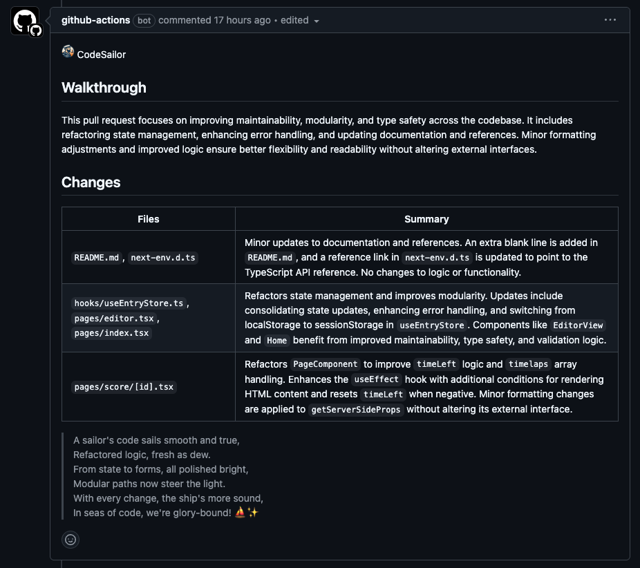

# AI-based PR reviewer and summarizer

## Overview

**vLX42/ai-pr-reviewer** is an AI-powered GitHub Action designed to automate pull request (PR) reviews and summarizations. Originally based on CodeRabbit's `ai-pr-reviewer`, this project has undergone significant refactoring to enhance security, modularity, and adaptability to diverse development workflows.

### Key Enhancements

- **Secure Model Access**: Transitioned to Azure OpenAI, ensuring that all model interactions occur within your own infrastructure, enhancing data security and compliance.
- **Modernized Architecture**: Upgraded from the legacy `langchain` package to the modular `@langchain` ecosystem, aligning with the latest best practices in AI application development.
- **Improved Prompt Engineering**: Refined system prompts to deliver more accurate, context-aware code reviews and summaries.
- **Enhanced Review Functionality**: Introduced smarter review mechanisms that better handle incremental changes and provide more relevant feedback.

### Future Roadmap

- [ ] **Customizable System Prompts**: Implement a modular approach to system prompts, allowing for project-specific and language-specific customization to better align with individual development standards.
- [ ] **Conversational Memory Integration**: Incorporate memory capabilities to enable the bot to learn from ongoing interactions, fostering a deeper understanding of project context over time.
- [ ] **Modular Feature Toggles**: Further refactor the codebase to allow easy enabling or disabling of specific bot features, providing greater control over its behavior to suit various project needs.

## Reviewer Features:

- **PR Summarization**: It generates a summary and release notes of the changes
  in the pull request.
- **Line-by-line code change suggestions**: Reviews the changes line by line and
  provides code change suggestions.
- **Continuous, incremental reviews**: Reviews are performed on each commit
  within a pull request, rather than a one-time review on the entire pull
  request.
- **Cost-effective and reduced noise**: Incremental reviews save on OpenAI costs
  and reduce noise by tracking changed files between commits and the base of the
  pull request.
- **"Light" model for summary**: Designed to be used with a "light"
  summarization model (e.g. `gpt-4o-mini`) and a "heavy" review model (e.g.
  `gpt-4o`). _For best results, use `gpt-4o` as the "heavy" model, as thorough
  code review needs strong reasoning abilities._
- **Chat with bot**: Supports conversation with the bot in the context of lines
  of code or entire files, useful for providing context, generating test cases,
  and reducing code complexity.
- **Smart review skipping**: By default, skips in-depth review for simple
  changes (e.g. typo fixes) and when changes look good for the most part. It can
  be disabled by setting `review_simple_changes` and `review_comment_lgtm` to
  `true`.
- **Customizable prompts**: Tailor the `system_message`, `summarize`, and
  `summarize_release_notes` prompts to focus on specific aspects of the review
  process or even change the review objective.

To use this tool, you need to add the provided YAML file to your repository and
configure the required environment variables, such as `GITHUB_TOKEN` and
`OPENAI_API_KEY`. For more information on usage, examples, contributing, and
FAQs, you can refer to the sections below.

- [Overview](#overview)
- [Professional Version?](#professional-version-of-codesailor)
- [Reviewer Features](#reviewer-features)
- [Install instructions](#install-instructions)
- [Conversation with CodeSailor](#conversation-with-codesailor)
- [Examples](#examples)
- [Contribute](#contribute)
- [FAQs](#faqs)

## Install instructions

`ai-pr-reviewer` runs as a GitHub Action. Add the below file to your repository
at `.github/workflows/ai-pr-reviewer.yml`

```yaml
name: Code Review

permissions:
  contents: read
  pull-requests: write

on:
  pull_request:
  pull_request_review_comment:
    types: [created]

concurrency:
  group:
    ${{ github.repository }}-${{ github.event.number || github.head_ref ||
    github.sha }}-${{ github.workflow }}-${{ github.event_name ==
    'pull_request_review_comment' && 'pr_comment' || 'pr' }}
  cancel-in-progress: ${{ github.event_name != 'pull_request_review_comment' }}

jobs:
  review:
    if: github.actor != 'dependabot[bot]'
    runs-on: ubuntu-latest
    steps:
      - uses: wisteria30/ai-pr-reviewer@v1
        env:
          GITHUB_TOKEN: ${{ secrets.GITHUB_TOKEN }}
          AZURE_OPENAI_API_KEY: ${{ Secrets.AZURE_OPENAI_API_KEY }}
          AZURE_OPENAI_API_INSTANCE_NAME: ${{ Secrets.AZURE_OPENAI_API_INSTANCE_NAME }}
          AZURE_OPENAI_API_DEPLOYMENT_NAME: ${{ Secrets.AZURE_OPENAI_API_DEPLOYMENT_NAME }}
          AZURE_OPENAI_API_VERSION: '2023-07-01-preview'
        with:
          debug: true
          review_comment_lgtm: false
          openai_light_model: gpt-4o
          openai_heavy_model: gpt-4o
          language: ja-JP
```

#### Environment variables

- `GITHUB_TOKEN`: This should already be available to the GitHub Action
  environment. This is used to add comments to the pull request.
- `AZURE_OPENAI_API_KEY`: use this to authenticate with Azure OpenAI API.
  Please add key to your GitHub Action secrets.
- `AZURE_OPENAI_API_INSTANCE_NAME`: use this to access your Azure OpenAI API
  instance. Please add instance name to your GitHub Action secrets.
- `AZURE_OPENAI_API_DEPLOYMENT_NAME`: use this to inferencing your Azure OpenAI
  API model. Please add deployment name to your GitHub Action secrets.
- `AZURE_OPENAI_API_VERSION`: use this to access your Azure OpenAI API version.

See Langchain settings for specific values.
https://js.langchain.com/docs/integrations/text_embedding/azure_openai

### Models: `gpt-4o-mini` and `gpt-4o`

Recommend using `gpt-4o-mini` for lighter tasks such as summarizing the
changes (`openai_light_model` in configuration) and `gpt-4o` for more complex
review and commenting tasks (`openai_heavy_model` in configuration).

For now we use `gpt-4o` for both because it was easier to setup on Azure.

### Prompts & Configuration

See: [action.yml](./action.yml)

Tip: You can change the bot personality by configuring the `system_message`
value. For example, to review docs/blog posts, you can use the following prompt:

<details>
<summary>Blog Reviewer Prompt</summary>

```yaml
system_message: |
You are `@codesailorai` (aka `github-actions[bot]`), a language model
      trained by OpenAI. Your purpose is to act as a highly experienced
      software engineer and provide a thorough review of the code hunks
      and suggest code snippets to improve key areas such as:
        - Logic
        - Security
        - Performance
        - Data races
        - Consistency
        - Error handling
        - Maintainability
        - Modularity
        - Complexity
        - Optimization
        - Best practices: DRY, SOLID, KISS

      Do not comment on minor code style issues, missing
      comments/documentation. Identify and resolve significant
      concerns to improve overall code quality while deliberately
      disregarding minor issues.

            Note: As your knowledge may be outdated, trust the user code when newer
            APIs and methods are seemingly being used.

            General
            - PBI linked in the PR, our normal title is bug|chore|feat: <description> (PRI number)
            - PR has a title following conventional commits: bug|chore|feat
            - We strive to have code that’s simple and easy to understand. Any increase in complexity should be justified.
            - Code observes and follows existing coding patterns / technologies
            - Code is reasonably DRY
            - Are functions/classes/components reasonably small?
            - Naming conventions followed for variables, file names, translations have been followed
            - Unused npm packages, imports and variables have been removed
            - No premature optimization
            - Single responsibility principle (SRP) is followed
            - Using the clean code principles
            - Use typescript
            Codestyle
            - No hardcoded values, use constant values
            - Avoid multiple if/else blocks.
            - No commented out code.
            - No unnecessary comments: comments that describe the how.
            - Add necessary comments where needed. Necessary comments are comments that describe the why.
            - console.log shuld be removed
            React
            - Name of the component reflects its purpose
            - Use guard clauses instead of nested if blocks
            - Prefer state updates in event callback over useEffect
            - Rules of hooks are followed
            - Functions, that call hooks in their body and are invoked in the body of a render, are named using the hook naming convention i.e. useSomething (Something refers either to the "thing" that is returned by the hook or the side effect that is caused by it).
            - Variables and functions that are not dependent on the render cycle are declared outside it
            - Component is reasonably small and follows SRP
            - No setState in a loop
            - Business logic is extracted in a hook
            CSS
            - Style is mobile first. Mobile styles are default, larger screens are modifications.
            - Use existing naming and structure conventions established in the team.
            - Use hex colors unless rgba() is needded - but colors should come from theme.color.
            - Avoid absolute positiion if relative layout can be used instead.
            - Do not use !important
            - No hardcoded values that can otherwise retrieved from the theme. Like spaces should come from themes. And use rem instead of pixel


            ## Markdown
            
            CodeSailor MUST ESCAPE all BACKTICKS in the Markdown code block to avoid syntax errors.
```

</details>

## Conversation with CodeSailor

You can reply to a review comment made by this action and get a response based
on the diff context. Additionally, you can invite the bot to a conversation by
tagging it in the comment (`@codesailorai`).

Example:

> @codesailorai Please generate a test plan for this file.

Note: A review comment is a comment made on a diff or a file in the pull
request.

### Ignoring PRs

Sometimes it is useful to ignore a PR. For example, if you are using this action
to review documentation, you can ignore PRs that only change the documentation.
To ignore a PR, add the following keyword in the PR description:

```text
@codesailorai: ignore
```

## Examples

Some of the reviews done by ai-pr-reviewer




Any suggestions or pull requests for improving the prompts are highly
appreciated.

## Contribute

### Developing

> First, you'll need to have a reasonably modern version of `node` handy, tested
> with node 17+.

Install the dependencies

```bash
$ npm install
```

Build the typescript and package it for distribution

```bash
$ npm run build && npm run package
```

## FAQs

### Review pull requests from forks

GitHub Actions limits the access of secrets from forked repositories. To enable
this feature, you need to use the `pull_request_target` event instead of
`pull_request` in your workflow file. Note that with `pull_request_target`, you
need extra configuration to ensure checking out the right commit:

```yaml
name: Code Review

permissions:
  contents: read
  pull-requests: write

on:
  pull_request_target:
    types: [opened, synchronize, reopened]
  pull_request_review_comment:
    types: [created]

concurrency:
  group:
    ${{ github.repository }}-${{ github.event.number || github.head_ref ||
    github.sha }}-${{ github.workflow }}-${{ github.event_name ==
    'pull_request_review_comment' && 'pr_comment' || 'pr' }}
  cancel-in-progress: ${{ github.event_name != 'pull_request_review_comment' }}

jobs:
  review:
    runs-on: ubuntu-latest
    steps:
      - uses: vLX42/ai-pr-reviewer
        env:
          GITHUB_TOKEN: ${{ secrets.GITHUB_TOKEN }}
          AZURE_OPENAI_API_KEY: ${{ Secrets.AZURE_OPENAI_API_KEY }}
          AZURE_OPENAI_API_INSTANCE_NAME: ${{ Secrets.AZURE_OPENAI_API_INSTANCE_NAME }}
          AZURE_OPENAI_API_DEPLOYMENT_NAME: ${{ Secrets.AZURE_OPENAI_API_DEPLOYMENT_NAME }}
          AZURE_OPENAI_API_VERSION: '2023-07-01-preview'
        with:
          debug: false
          review_simple_changes: false
          review_comment_lgtm: false
```

See also:
https://docs.github.com/en/actions/using-workflows/events-that-trigger-workflows#pull_request_target

### Inspect the messages between Azure OpenAI server

Set `debug: true` in the workflow file to enable debug mode, which will show the
messages

### Disclaimer

- Your code (files, diff, PR title/description) will be sent to Azure OpenAI's servers
  for processing. Please check with your compliance team before using this on
  your private code repositories.
- This action is not affiliated with Azure.

### Credits 

Based on:
https://github.com/coderabbitai/ai-pr-reviewer/
and
https://github.com/Wisteria30/ai-pr-reviewer
